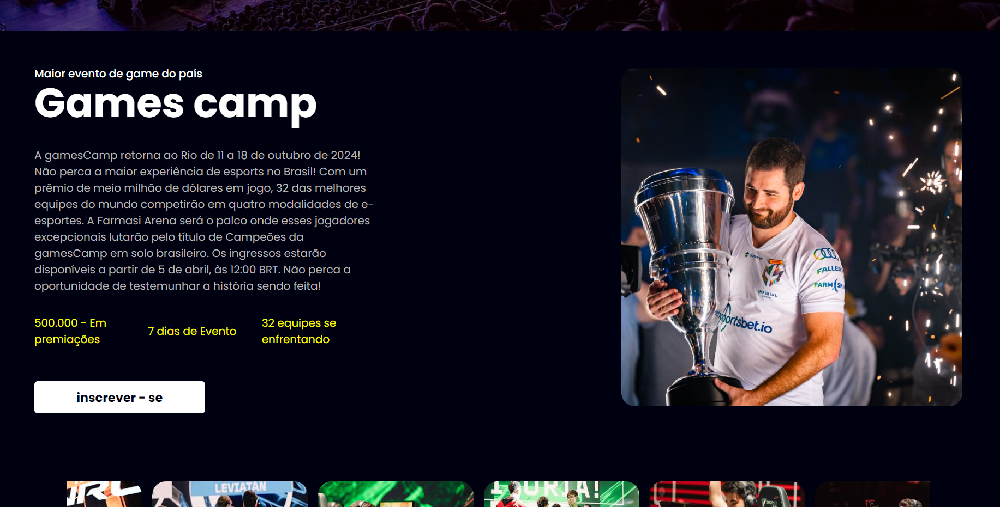

# GamesCamp - Desafio Nadic
Este projeto foi desenvolvido como parte do desafio da trilha do Nadic, utilizando React, StyledComponents e typesScript para criar uma interface visual e interativa de um evento fictício. O objetivo deste desafio é simular o desenvolvimento de uma aplicação visual para a gestão de eventos, aplicando conceitos de frontend.
Nessa segunda parte do desafio foi adicionado a mais uma página de confirmação de inscrição em relação ao projeto inicial como também melhorias na responsividade e no design system dos componentes do projeto.
Esse projeto mesmo simples foi um grande aprendizado sobre styled componets como também a criação de um design system proprio, me ajudando a aumentar minha experiência como programador e que venha o prôximo desáfio.

## Tecnologias Utilizadas
REACT : Para criação dos componentes e estrutura do site.   
TYPESCRIPT : Ultilizado para adicionar interatividade à aplicação e gerenciar as ações do evento.   
STYLED COMPONENTS : Ultilizado para estilizar os componentes e escopar o css.   
REACT ROUTER DOM : Ultilizado para fazer as rotas e ligações das páginas.   
NOTION : Para organização das taks a serem feitas e evelução do projeto.   

## Como Rodar o Projeto

Clone o repositório:

```bash
git clone https://github.com/Dom-Garotom/GamesCamp.git
```

Navegue até o diretório do projeto:

```bash
cd gamesCamp
```

Execute o projeto em localHodt:

```bash
npm run dev
```
